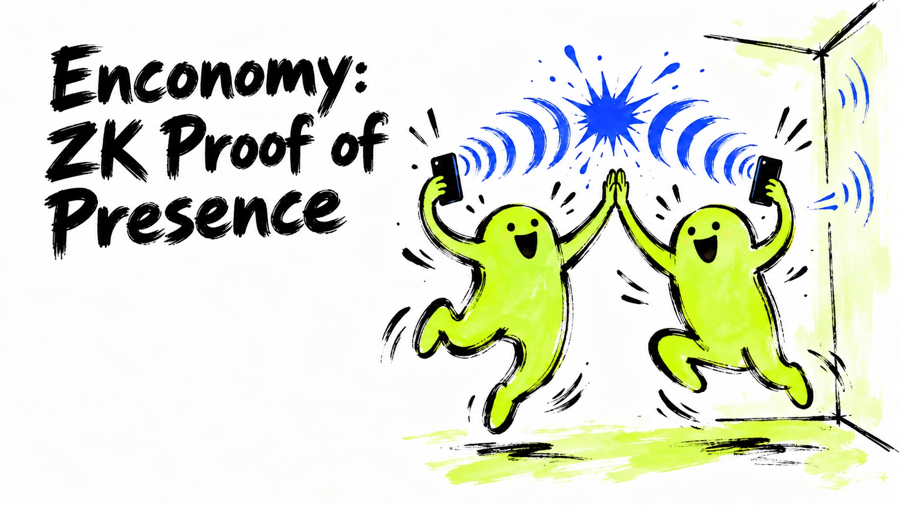
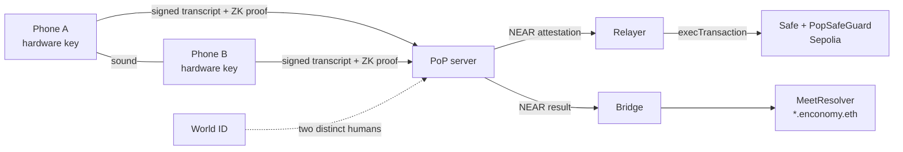
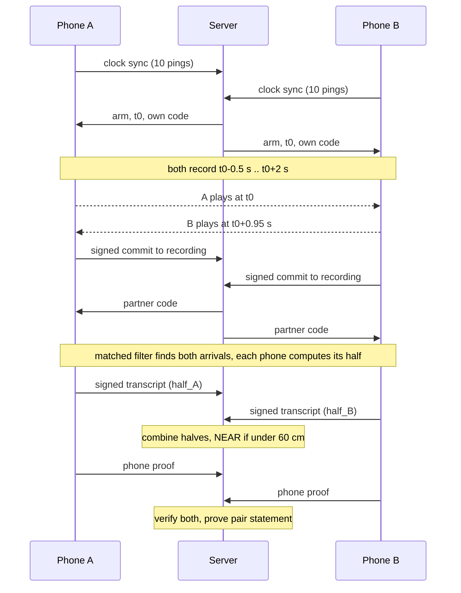

# enconomy



Proof of presence: two phones use sound to prove they were physically close.

Each phone plays a short coded sound and records both its own sound and its partner's. Each phone times when the two sounds reach its mic. Put the two phones' timings together and you get a distance, without the clocks being in sync. If the distance is under 60 cm, the verdict is NEAR. Each phone signs its half of the measurement with a hardware key, and a zero-knowledge proof ties that half to the recording without revealing the recording. A NEAR result can unlock a 2-of-4 Safe spend, or it can be recorded as a meeting under `enconomy.eth` on ENS. Both run on Ethereum Sepolia.



This is a hackathon build. It runs on testnet only, it has not been audited, and the field data is limited. See [Limitations](#limitations).

## Quick start

```sh
cd server
uv sync
uv run pytest -q
uv run python -m pop        # 0.0.0.0:8000
```

## Requirements

- Python 3.11 or newer and [uv](https://docs.astral.sh/uv/), for the server.
- Node and npm, for the World ID sidecar and the relayer. It was tested with Node 24. No `engines` field is pinned.
- JDK 21 and the Android SDK for the app, plus Xcode for iOS. JDK 26 is too new for Gradle 8.14.
- Rust, NDK 28.2.13676358, cargo-ndk and zig 0.15. You need these only to build `app/zkprove`.
- Foundry (forge, cast, anvil) with solc 0.8.30.
- Barretenberg `bb` 5.0.0-nightly.20260522 at `~/.enconomy/zk/pinned/bin/bb`. This is optional. Without it, the ZK routes answer `503 zk_unavailable`.
- For the full demo: `cloudflared`, `sqlite3`, and a Sepolia key at `~/.enconomy/ens-sepolia.key` holding at least 0.05 ETH.

The contract dependencies are git submodules:

```sh
git submodule update --init
```

## Building and testing

**Server**

```sh
cd server
uv run python -m pop        # 0.0.0.0:8000, change with POP_HOST / POP_PORT
uv run pytest -q
```

The standalone server defaults to port 8000. The demo runs it on 8001, because the tunnel points there.

**App (Android)**

```sh
cd app
./gradlew :composeApp:assembleDebug :composeApp:testDebugUnitTest
./gradlew :composeApp:assembleDebug -Ppop.serverUrl=https://your-server   # default http://10.0.2.2:8000
./gradlew :composeApp:assembleDebug -Ppop.buildProver=true               # also builds zkprove
```

**App (iOS simulator tests, web build)**

```sh
cd app && ./gradlew :composeApp:iosSimulatorArm64Test
app/scripts/build_web.sh    # Kotlin/Wasm -> server/web-app/, serve with POP_ALLOW_WEB=1 POP_WEB_DIR=web-app
```

**Native prover**

```sh
cd app/zkprove
scripts/build_android.sh    # dist/android/arm64-v8a/libzkprove.so
scripts/build_ios.sh        # dist/ios/ZkProve.xcframework
```

**Contracts**

```sh
cd contracts
forge build && forge test
FORK=1 forge test --match-contract PopSafeForkTest     # against Sepolia Safe 1.5.0
```

**Relayer** (dry run on an anvil fork of Sepolia, test keys only)

```sh
anvil --fork-url https://sepolia.gateway.tenderly.co --hardfork osaka --port 8612 --silent &
cd relayer && RPC=http://127.0.0.1:8612 test/dryrun.sh
```

**Static ENS site**

```sh
cd web && python3 -m http.server 8080    # preview
npx wrangler deploy                      # from repo root
```

Each component README has more detail.

## Demo stack

One command runs the whole demo. It starts five processes: the server (:8001), the World ID sidecar (:8787), the ENS bridge, the Safe relayer and the `pop.enconomy.dev` tunnel. Log lines are prefixed `[server]`, `[sidecar]` and so on, and are also saved in `.demo/logs/`.

First-time setup:

```sh
(cd server && uv sync)
(cd server/idkit-sidecar && npm ci)
(cd relayer && npm ci)
cp server/.env.example server/.env
echo 'POP_ATTEST_KEY_FILE=data/attest-demo.pem' >> server/.env   # key the demo Safe pins
cp bridge/names.example.json bridge/names.json                    # device_id -> ENS label
```

Set `POP_ATTEST_KEY_FILE`, or every Safe spend reverts with `BadAttestation`. The default `data/attest.pem` is a different key. `attest-demo.pem` is gitignored. [`contracts/README.md`](contracts/README.md) explains how to derive it.

```sh
./demo check          # preflight: tools, node_modules, key + Sepolia balance, bridge/names.json, ports, tunnel
./demo up             # all five; Ctrl-C stops everything
./demo up --web       # also sets POP_ALLOW_WEB=1 and POP_CORS_ORIGINS for the web app
./demo up --no-tunnel --no-ens --no-safe --no-worldid   # skip pieces
./demo status         # what is running, plus bridge status
```

Server config lives in `server/.env`, and real environment variables override it. The demo sets `POP_TEST_KINDS=1`, `POP_WORLDID_SANDBOX=1` and `POP_ALLOW_UNATTESTED=1`, unless you set them yourself. If one process dies, a banner names it and the others keep running. `./demo up` then exits nonzero when it stops. Run `./demo help` for details.

## How it works

### The sound

Each phone plays one 250 ms clip, which the code calls JBL250. The clip has two layers:

- **A public two-note tune** below 1.6 kHz. Role A plays E4 to A4, role B plays C5 to G4. It lets people hear that a check is running.
- **A secret noise layer** from 2 to 18 kHz, 6 dB below the tune. Only this layer is used for timing.

The codes are derived per session, role and attempt. The server sends a phone its partner's code only after it receives that phone's signed commit. A tune on its own can't carry a secret, because anyone can record it and replay it. The melody bakeoff is in [`research/sound-bound/spikes/melody/RESULTS.md`](research/sound-bound/spikes/melody/RESULTS.md).

### The run

1. Each phone syncs its clock to the server over 10 pings. The server refuses to arm if the best round trip is over 300 ms.
2. The server picks a start time `t0` about 3 s ahead.
3. Both mics record from `t0 - 0.5 s` to `t0 + 2 s`, with echo cancellation, noise suppression and auto gain turned off.
4. A plays at `t0`. B plays at `t0 + 0.95 s`.

Each recording ends up with both sounds in it.



### The distance formula

Write `t_XY` for the time at which Y's recording hears X:

```
half_A = t_BA - t_AA        # measured only in A's file
half_B = t_BB - t_AB        # measured only in B's file
flight_cm = 34300 / 2 * (half_A / sr_A - half_B / sr_B)
```

Let `u` be the gap between B firing and A firing. It includes the clock offset and the speaker latency, which is 20 to 200 ms. A's file measures `u + tau` and B's file measures `u - tau`, where `tau` is the flight time. Subtract one from the other and you get `2 tau`, so `u` cancels out. Neither phone needs to know the real time.

The result still contains half of each phone's own speaker-to-mic path, so two phones that are touching read about 8 cm. This makes it a distance bound, not a ruler. A relay can only add delay, which makes the reading larger, never smaller.

The arrival detector is a matched filter on the secret layer. Its threshold comes from scoring the same recording against 64 random codes. Recordings with audio dropouts are rejected. The phone's own arrival must also match the OS output timestamp.

Verdicts are set in `server/pop/constants.py`:

- **NEAR** if `-20 < flight < 60` cm.
- **NOT NEAR** (`too_far`) if `flight >= 60`. There is no retry.
- Anything else, such as a glitch, a missing arrival or an impossible value, retries once with fresh codes (`MAX_ATTEMPTS = 2`).

### Keys and signatures

Every device has a P-256 key. On Android the key lives in the Keystore (StrongBox if the phone has it, otherwise the TEE) with Key Attestation. On iOS it lives in the Secure Enclave with App Attest. Every device and session call is signed.

In each run, each phone first signs a commit to its recording. That is the sha256 in v1, or a Poseidon2 Merkle root in v2. Only after that does the server release the partner's code. The phone then signs a fixed-layout transcript with its half and the session details. The server checks both transcripts and combines the halves. If the roles are swapped, the sign flips, so a far pair reads negative instead of near.

### Zero-knowledge proof

Each phone proves its own half with Noir and Barretenberg UltraHonk (BN254). The circuit checks the transcript signature, the device credential, that the two keys are different, the Merkle openings into the recording, and the arrival rule at both arrivals. It outputs a hiding commitment to the half. A phone that can't prove sends its inputs to `/proof/delegate`, and the server proves that half instead. Once both phone proofs are verified, the server proves a pair statement. The pair statement opens both commitments and checks NEAR and distinct keys. The byte layouts and hashes are in [`zkmobile/APP_SERVER_CONTRACT.md`](zkmobile/APP_SERVER_CONTRACT.md).

### On chain (Ethereum Sepolia, 11155111)

- **Safe.** A Safe 1.5.0 with 2-of-4 owners: phone A, phone B and two guardians. The phone owners are P-256 keys, checked through the RIP-7212 P-256 verify precompile at `0x100`. `PopSafeGuard` requires three things on every normal transaction: proof of presence, signatures from both phones, and registered devices. Guardians on their own get only a time-locked recovery path. The live verifier, `PopAttestationVerifier`, checks a P-256 attestation from the server. The server signs it only after a NEAR verdict with two distinct World ID humans. The relayer then submits `execTransaction`.
- **ENS "Met on ENS".** `MeetResolver` is a wildcard resolver for `*.enconomy.eth` on ENSv2 Sepolia. It serves live meeting counters as text records. The bridge writes each NEAR result to it.
- **ZK verifiers.** `PhoneVerifier`, `PairVerifier` and `VerifyLog` are deployed, and they verify a real fixture.

World ID is checked only on the server, never on chain.

## Repository layout

| Path | What it is |
|---|---|
| [`app/`](app/README.md) | Kotlin Multiplatform app "pop" for Android, iOS and Kotlin/Wasm web: enroll, pairing, runs, on-device prover. |
| `app/zkprove/` | Rust native prover (Barretenberg + ACVM), exposed over JNI and a C ABI. |
| [`server/`](server/README.md) | FastAPI PoP server: enroll, sessions, verdict, World ID gate, ZK verify and delegated proving, Safe attestation. |
| `server/idkit-sidecar/` | Node sidecar for World ID IDKit, on port 8787. |
| [`contracts/`](contracts/README.md) | Foundry: `PopSafeGuard`, `P256Owner`, verifiers, `MeetResolver`, ZK verifiers in [`contracts/zk/`](contracts/zk/README.md). |
| `relayer/` | Submits Safe transactions for NEAR Safe-spend sessions (viem). |
| [`bridge/`](bridge/README.md) | Writes NEAR results to the ENS `MeetResolver` (Python + `cast`). |
| [`web/`](web/README.md) | Static "Met on ENS" leaderboard page. `build_web.sh --workers` can also put the Wasm app into `web/app/`. |
| `zkmobile/` | Spikes behind the Noir port: Android and iOS prove runs, hash vectors, toolchain pin. |
| [`research/sound-bound/`](research/sound-bound/README.md) | Acoustic prototype, field tests, melody bakeoff, ZK spikes. |
| `research/*.md` | Decision notes and threat model. |
| [`tools/dsp-fixtures/`](tools/dsp-fixtures/README.md) | Parity fixtures that tie the Kotlin receiver to the Python reference. |
| `demo` | One-command launcher for the demo stack. |
| `wrangler.jsonc` | Cloudflare Worker deploy config for `web/`. |

`app/prover/` is the old circom/Spartan2 prover. The app no longer uses it.

## Deployments

Everything is deployed on Ethereum Sepolia (11155111). The full lists are in [`contracts/DEPLOYMENTS.md`](contracts/DEPLOYMENTS.md) and [`ENS.md`](ENS.md).

| Contract | Address |
|---|---|
| PopSafeGuard | `0x1e0AD6528e6769508A241b78b73A6F9b1342bb3B` |
| PopAttestationVerifier | `0xD9E2F407424a7422E195d034ECc4fC932120d96F` |
| PopSafeSetup | `0x3d4e549F13CCee540884481b35Fd1CA42A9E0707` |
| P256OwnerFactory | `0x99565991Ec5414Ee2d3A2fA48Ab4d92efBd2466e` |
| MeetResolver | `0xfc300a640ccdEFF0e61f7875D55A9Cd22eb51346` |
| PhoneVerifier | `0x5b69C5a7D3e5A56D33809b9B95d02984D4aFa791` |
| PairVerifier | `0xfFA0cf3d79E2a27bC11b9E67eDB979a9b5BE3Fd7` |
| VerifyLog | `0x53D6DB2580466FeE5F07c4Bb7b4c07C41797B996` |

- Demo Safe: `0x1399D5F9B91B92EF8220E9328743Ac5F370Ed6d4`. It uses test phone keys, not real phones. A spend with presence cost 157,502 gas. A guardian spend without presence reverts with `NoPresence`.
- ENS site: https://ens.enconomy.dev
- PoP server: https://pop.enconomy.dev. It is a tunnel to a laptop, so it is not always up.

## Limitations

- **Cheating participant.** A phone that edits its own recording can cancel out a relay delay and fake NEAR. Neither the acoustics nor the ZK proof can stop that. The defense is an attested app with a hardware key. A browser can't attest, so the web app is a demo tier with a software key. Two phones working together can fake anything.
- **Evidence base.** The field data is 12 JBL250 sessions in one quiet room, with one Mac + Android pair. iPhones and noisy venues have not been tested.
- **Margin.** Pairs at 30 cm read at most 35 cm, and pairs at 100 cm read at least 95 cm. Handheld runs at 60 cm read 60 to 90 cm.
- **ZK.** Proofs work only at 48 kHz, so 44.1 kHz sessions skip the proof. The phone downloads about 82 MB of proving files first. The Noir presence adapter for the Safe is built and gas-tested but not deployed.
- **Server.** The Android attestation chain is not pinned to Google's root. The server must run as a single uvicorn worker.
- **Docs.** The "Option A proofs" section of `server/README.md` still describes the retired circom/Spartan2 prover.

## Further reading

- [`research/2026-09-26-sound-bound-decision.md`](research/2026-09-26-sound-bound-decision.md): why JBL250 and the 60 cm line.
- [`research/2026-09-25-cheating-participant-and-trust.md`](research/2026-09-25-cheating-participant-and-trust.md): derivation of the formula, and the threat model.
- [`research/2026-09-26-zk-gap-research.md`](research/2026-09-26-zk-gap-research.md): the ZK options.
- [`zkmobile/APP_SERVER_CONTRACT.md`](zkmobile/APP_SERVER_CONTRACT.md): the app-server ZK contract, including hashes and the Merkle layout.
- [`contracts/PREFLIGHT.md`](contracts/PREFLIGHT.md): chain facts and Safe hardening notes.

## License

There is no license file yet, so all rights are reserved by default.
